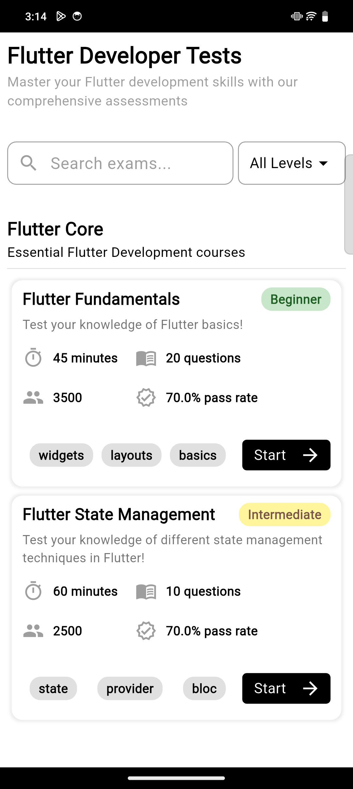
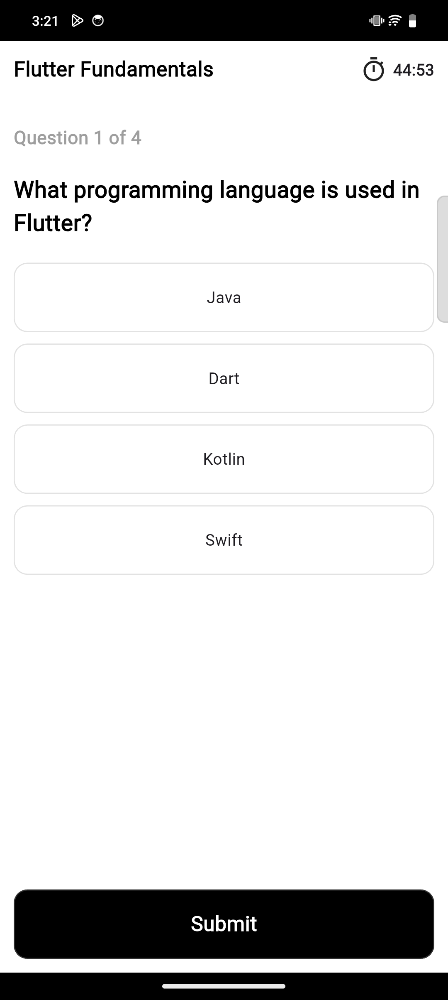
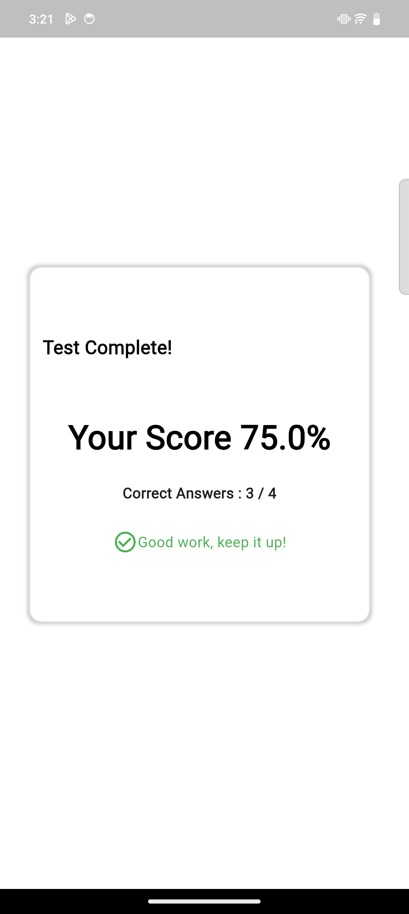

# Quiz App

This is a Flutter-based quiz application using GetX for state management.

## Features
- Multiple-choice and single-choice questions
- Score tracking
- Auto-submit when the timer runs out
- GetX state management for reactive UI updates
- Timer functionality for the quiz countdown

## Screenshots

## How to Run
1. Clone the repository.
2. Run `flutter pub get` to install dependencies.
3. Use `flutter run` to start the app.

## Dependencies
- `flutter`
- `get`

## License
This project is open-source under the MIT License.

